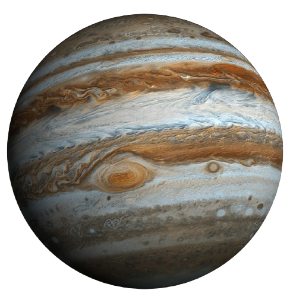

# Sistema-Solar

Desenvolvi minha primeira aplicação usando React: uma página para listar todos os planetas do Sistema Solar e também algumas das missões espaciais mais conhecidas

## Trybe

Nos últimos dias, você aprendeu alguns dos conceitos básicos de React: componentes, props e composição de componentes. Há muito mais o que aprender, uma vez que React é uma biblioteca JavaScript bem extensa. No entanto, o verdadeiro aprendizado vem com a prática, e, quanto mais cedo você colocar a mão na massa, melhor.

Você já está acostumado a construir sites relativamente complexos. Porém, desta vez, você está lidando com tecnologias novas, e toda tecnologia nova leva algum tempo até ser verdadeiramente assimilada. Por isso, o site que você construirá é simples, em comparação com seus últimos projetos. O objetivo aqui é consolidar os novos conceitos que você aprendeu, antes de partirmos para coisas mais complexas.

O que vamos avaliar?
Aderência do código à especificação. Seu programa deve se comportar como especificado na próxima seção.
Organização do seu código. Quebre seu site em componentes. Prefira componentes pequenos, simples e bem definidos a componentes grandes e complexos.

## Trybe para mim:

Que arraso, Pablo Landim de Sá ! Você conseguiu a nota máxima neste projeto!
#VQV!

